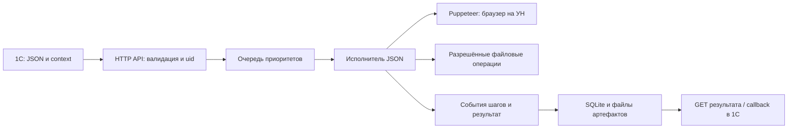

# Схема проекта для следующего программиста

## Поток задания



Сервис работает на каждой УН. 1С выбирает УН и ставит задание; сам этот репозиторий не является центральным распределителем по всем машинам. Scheduled Task запускает Node под Windows-пользователем с доступной ЭЦП. Для видимого браузера нужна его интерактивная сессия.

## Где менять код

| Файл | Ответственность |
| --- | --- |
| src/server.js | HTTP, авторизация, валидация запроса, uid/идемпотентность, очередь, SQLite, callback, конфигурация |
| src/json-workflow.js | Универсальные action, контекст, управление выполнением, события, отмена, браузер |
| src/workflow-schema.js | Допустимые операции и рекурсивная проверка структуры workflow |
| src/workflow-expression.js | Изолированный worker/VM для compute |
| src/workflow-files.js | Проверка разрешённых путей, SHA-256, копирование и архивирование |
| src/browser-replay.js | Нативный Recorder / Puppeteer Replay, запуск браузера и uploadFiles |
| src/interpreter.js | Диспетчер форматов, шаблоны; старый json-steps для совместимости |
| src/job-result.js | Публичный результат: artifacts и объекты Rezult_N |
| src/system-checks.js | ipify, настройки IP-монитора, данные ресурсов |
| src/job-retention.js | Определение срока хранения завершённых заданий |
| demo/sbis-report-full.json | Вся логика СБИС: условия, ведомства, ЭЦП, UI, проверки и отправка |
| windows/ | Preflight, запуск и регистрация Scheduled Task |
| openapi.yaml | Контракт API; обновлять вместе с реализацией |
| test/ | Модульные и интеграционные проверки |

Для нового сайта сначала меняйте JSON, а не сервер. В json-workflow нет специальных select_authority/auth_ecp: правила сайта выражены общими действиями. Старые имитационные действия json-steps не являются рабочим универсальным механизмом СБИС.

## Контракт и состояние

SQLite лежит в DATA_DIR/state.sqlite; снимки задания, логи и параметры хранятся там. Артефакты — в DATA_DIR/artifacts/JOB_ID. Обновление кода не должно стирать .env, DATA_DIR, рабочие XML и исходные ЭЦП.

Успех POST означает постановку в очередь. Повтор того же uid с тем же запросом возвращает старое задание; изменение запроса при прежнем uid даёт конфликт. Меньшее priority — выше приоритет. Параллельность ограничивается настройкой max_parallel_jobs; для СБИС с одной интерактивной сессией используйте 1.

Публичный result не равен внутреннему контексту исполнителя. serializeJobResult оставляет artifacts и объектные Rezult_N. В 0.6.17 артефакт — `{filename,api_url}`; локальный путь не выдаётся. Поле filename может быть null для старого состояния, сохранившего только URL.

Шаги for_each/if/call разворачиваются при исполнении; total_steps растёт. События и раскрытая история сохраняются. Тайм-аут или отмена ограничивают дальнейшие действия; нормальная ошибка может запустить JSON on_error, который не превращает ошибку в успех. Автоповтор всего workflow после ошибки исполнения отключён.

## Порядок доработки

1. Воспроизвести проблему коротким сценарием/HTTP-запросом.
2. Проверить формат: Recorder, json-workflow или старый json-steps.
3. Для правил конкретного сайта править JSON и его UI-профиль.
4. Для новой общей операции обновить schema, executor, OpenAPI и каталог/документацию.
5. Добавить проверку реального поведения, ошибки и отмены, если изменение этого требует.
6. Запустить относящиеся тесты, затем проверить коротким безопасным заданием на УН.
7. Перед коммитом выполнить `npm run version:bump -- patch`, затем `npm run version:check`. Все коммиты повышают package.json, package-lock.json и OpenAPI.

Команды проверки:

```powershell
npm.cmd test
node --test test/json-workflow.test.js test/sbis-json.test.js
node --test test/server.test.js test/system-checks.test.js test/job-result.test.js
```

Нужен локальный браузер, а некоторым тестам — локальные HTTP-серверы. Windows-ограничение очистки SQLite в system-checks описано в [проверках](07-verification.md); не выдавайте падение teardown за успех всего набора.

Не оценивайте готовность только по версии /health: проверяйте требуемые поля API и ожидаемые эффекты. Не храните секреты и XML отчётности в коммитах. Для новых UI-профилей фиксируйте, какой экран и какое состояние реально проверены.
